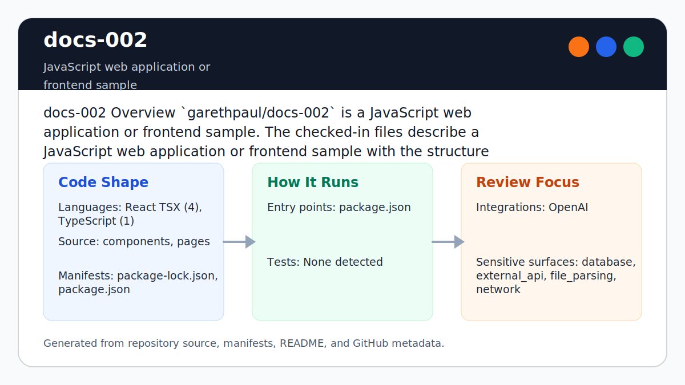

# docs-002

<!-- README-OVERVIEW-IMAGE -->


## Overview

`garethpaul/docs-002` is a JavaScript web application or frontend sample. The checked-in files describe a JavaScript web application or frontend sample with the structure summarized below.

This README is based on the checked-in source, manifests, scripts, and repository metadata on the `main` branch. The project language mix found during review was: React TSX (4), TypeScript (1).

## Repository Contents

- `README.md` - project overview and local usage notes
- `package.json` - JavaScript dependency and script metadata
- `components` - source or example code
- `package-lock.json` - JavaScript dependency and script metadata
- `pages` - source or example code
- `SECURITY.md` - security reporting and disclosure guidance
- `Makefile` - repository-level verification wrapper
- `VISION.md` - project direction and maintenance guardrails

Additional scan context:

- Source directories: components, pages
- Dependency and build manifests: package-lock.json, package.json
- Entry points or build surfaces: package.json, Makefile
- Test-looking files: no obvious test files detected

## Getting Started

### Prerequisites

- Git
- Node.js 20.19 or newer and npm

### Setup

```bash
git clone https://github.com/garethpaul/docs-002.git
cd docs-002
npm ci
export OPENAI_API_KEY=sk-...
# Optional: comma-separated allow-list for proxied chat models.
export OPENAI_ALLOWED_MODELS=gpt-4o-mini,gpt-3.5-turbo
```

The setup commands above are derived from repository files. Legacy mobile, Python, or JavaScript samples may require older SDKs or package versions than a modern workstation uses by default.

## Running or Using the Project

- Run `npm start` for the default development command.
- Run `npm run dev` for the development server.

Detected npm scripts:

- `npm run audit` - `npm audit --audit-level=high`
- `npm run build` - `node node_modules/next/dist/bin/next build`
- `npm run check` - `scripts/check-baseline.sh`
- `npm run dev` - `node node_modules/next/dist/bin/next dev`
- `npm run lint` - `eslint components pages scripts --ext ts,tsx --max-warnings=0`
- `npm run start` - `node node_modules/next/dist/bin/next start`
- `npm run test` - `npm run lint && npm run type-check && npm run test:parser && npm run build && npm run check && npm run audit`
- `npm run test:parser` - `node node_modules/tsx/dist/cli.mjs scripts/test-execute-parser.ts`
- `npm run type-check` - `node node_modules/typescript/bin/tsc --noEmit`

## Testing and Verification

Run the local verification gate before changing the editor or execute API:

```bash
make check
npm test
```

`make check` delegates to `npm test`, which runs the zero-warning
TypeScript/TSX lint gate, TypeScript checks, focused execute parser/validator
regression tests, the Next build, the source baseline guard, and
`npm audit --audit-level=high`. The execute API requires `OPENAI_API_KEY` at
runtime and validates submitted examples before calling the OpenAI SDK.

When the required SDK or runtime is unavailable, use static checks and source review first, then verify on a machine that has the matching platform toolchain.

## Configuration and Secrets

- Detected references to OpenAI. Keep API keys, OAuth credentials, tokens, and account-specific values in local configuration only.
- `OPENAI_API_KEY` must be provided through the environment. Do not commit
  OpenAI keys or sample outputs containing private prompt data.
- `OPENAI_ALLOWED_MODELS` can narrow the comma-separated chat model allow-list.
  It can only narrow the checked-in default model allow-list; unsupported
  values are not allowed to expand the proxy. When unset, the execute API only
  accepts the checked-in defaults.

## Security and Privacy Notes

- Review changes touching external API calls or credential-adjacent configuration; examples from the scan include components/Editor.tsx, package.json, pages/api/execute/code.ts, pages/index.tsx.
- Review changes touching network requests, sockets, or service endpoints; examples from the scan include components/Editor.tsx, components/Navigation.tsx.
- Review changes touching file, media, JSON, XML, CSV, OCR, or data parsing; examples from the scan include components/Editor.tsx, components/Navigation.module.css, pages/api/execute/code.ts.
- Review changes touching database, model, or persistence code; examples from the scan include components/Editor.tsx, pages/index.tsx.

## Maintenance Notes

- See `SECURITY.md` for vulnerability reporting and safe research guidance.
- See `VISION.md` for project direction and contribution guardrails.
- See `docs/plans/2026-06-08-docs-execute-api-baseline.md` for the current
  execute API hardening baseline.
- See `docs/plans/2026-06-08-docs-lint-gate.md` for the TypeScript lint gate.
- See `docs/plans/2026-06-09-model-allowlist-narrowing.md` for model
  allow-list narrowing semantics.

## Contributing

Keep changes small and tied to the project that is already present in this repository. For code changes, document the toolchain used, avoid committing generated dependency directories or local configuration, and update this README when setup or verification steps change.
